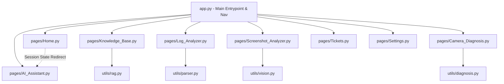

# Implementation Plan: Smart Camera Support Portal (AI Camera Support Assistant)

This implementation plan details the setup and design of a production-ready, beautiful Streamlit-based Support Portal. The application is designed to showcase high-fidelity prototypes of AI capabilities (chat, guided troubleshooting, diagnostics, log analysis, and screenshot OCR) that are ready to run locally, looking like a real premium SaaS product.

---

## User Review Required

> [!IMPORTANT]
> **Aesthetic Design and Layout**
> - We will implement a cohesive, premium Dark Theme using Streamlit's configurations and inject a customized global CSS stylesheet.
> - The application layout will be organized as a modern, multi-column dashboard rather than a single-column sequence of elements.
>
> **Project Directory Location**
> - The code will be placed directly in the active workspace directory `f:\New folder\TechRise\Manycam\AI_Support` (referred to as the project root below). This is where the Python virtual environment has been activated.

---

## Proposed Changes

We will create the directory structure and files directly inside `f:\New folder\TechRise\Manycam\AI_Support`.

### 1. App Configuration and Routing

#### [NEW] [.streamlit/config.toml](file:///f:/New%20folder/TechRise/Manycam/AI_Support/.streamlit/config.toml)
Configure a premium dark theme.
- Primary Color: Indigo (`#6366f1`)
- Background Color: Dark Navy (`#0b0f19`)
- Secondary Background Color: Slate Blue (`#1e293b`)
- Text Color: Crisp White (`#f8fafc`)

#### [NEW] [app.py](file:///f:/New%20folder/TechRise/Manycam/AI_Support/app.py)
The central entry point of the app. It will:
- Initialize the application layout (wide mode, page title: "Smart Camera Support Portal").
- Load a global CSS system to style headers, buttons, cards, and input fields.
- Define programmatically structured pages using Streamlit's native `st.navigation` and `st.Page` system.
- Manage shared session state (e.g., active ticket logs, diagnostic logs, and the current active troubleshooting flow state).

---

### 2. Portal Pages (`pages/`)

#### [NEW] [Home.py](file:///f:/New%20folder/TechRise/Manycam/AI_Support/pages/Home.py)
The dashboard main page. Organized in columns:
- **Left Column (Core Interactive Flows):**
  - **Quick AI Chat:** An interactive textbox. Typing a question and pressing "Ask AI" will redirect the user to the `AI Assistant` tab and pre-fill the chat.
  - **Guided Trouble-Shooter:** Radio selection of common issues (Camera Not Detected, Black Screen, PTZ Not Moving, etc.) with a "Continue" button. Clicking this redirects to the `AI Assistant` with the corresponding step-by-step questionnaire active.
- **Right Column (Utility Side-Panels):**
  - **Quick Diagnostic:** Minimal form for Camera IP and a "Diagnose" button (redirects to Diagnosis).
  - **Quick Uploads:** Upload Screenshot or Upload Log shortcuts.
  - **Recent FAQs:** List of clickable hyper-relevant questions that populate the search query in the Knowledge Base.

#### [NEW] [AI_Assistant.py](file:///f:/New%20folder/TechRise/Manycam/AI_Support/pages/AI_Assistant.py)
This page handles two modes:
1. **Interactive AI Chat:** A ChatGPT-like chat window where users can converse with a camera expert assistant.
2. **Guided Questionnaire:** Shows step-by-step diagnostic questions (Windows/macOS, connection type, Device Manager status, symptoms, history, screenshot). Once completed, displays a simulated "Processing" loader followed by a diagnostic report (Confidence rating, possible causes, step-by-step resolution steps, and options to upload logs or talk to an engineer).

#### [NEW] [Knowledge_Base.py](file:///f:/New%20folder/TechRise/Manycam/AI_Support/pages/Knowledge_Base.py)
A search interface for documentation. Reads real markdown guides inside `data/` and performs search matching. Shows a clean list of articles and allows clicking on them to display full details in styled containers.

#### [NEW] [Camera_Diagnosis.py](file:///f:/New%20folder/TechRise/Manycam/AI_Support/pages/Camera_Diagnosis.py)
Interactive PTZ Camera Health Check page.
- Input Camera IP, Username, Password.
- Runs a real check: checks ping to the IP.
- Simulates detailed checks (ONVIF discovery, RTSP stream availability, firmware check).
- Shows live terminal-style check-boxes (e.g. `✔ Camera Reachable`, `✖ Firmware Outdated`).

#### [NEW] [Screenshot_Analyzer.py](file:///f:/New%20folder/TechRise/Manycam/AI_Support/pages/Screenshot_Analyzer.py)
Upload tool for error screenshots. Displays the image, runs mock optical analysis, identifies visual error messages (such as "No Camera Found" or "Device Conflict"), and suggests fixes.

#### [NEW] [Log_Analyzer.py](file:///f:/New%20folder/TechRise/Manycam/AI_Support/pages/Log_Analyzer.py)
Upload tool for manycam logs. Parses files searching for errors, lists summary statistics (e.g. "3 Errors Found"), and outlines recommendations.

#### [NEW] [Tickets.py](file:///f:/New%20folder/TechRise/Manycam/AI_Support/pages/Tickets.py)
Simulated ticketing system. Shows current open/resolved support tickets, progress statuses, and options to create a ticket if the AI-driven steps fail.

#### [NEW] [Settings.py](file:///f:/New%20folder/TechRise/Manycam/AI_Support/pages/Settings.py)
Preferences dashboard (e.g. API keys setup, custom models, system configurations).

---

### 3. Utility Modules (`utils/`) and Data Files

To keep code clean and modular:
- **[NEW] [rag.py](file:///f:/New%20folder/TechRise/Manycam/AI_Support/utils/rag.py):** Implements keyword matching search over guides and FAQs.
- **[NEW] [parser.py](file:///f:/New%20folder/TechRise/Manycam/AI_Support/utils/parser.py):** Scans file contents for error statements.
- **[NEW] [diagnosis.py](file:///f:/New%20folder/TechRise/Manycam/AI_Support/utils/diagnosis.py):** Performs real ICMP ping (using Python subprocess or socket) and returns details.
- **[NEW] [vision.py](file:///f:/New%20folder/TechRise/Manycam/AI_Support/utils/vision.py):** Scans file attributes/name or processes text matching for mock screenshot reading.
- **[NEW] [data/](file:///f:/New%20folder/TechRise/Manycam/AI_Support/data/):** Populate markdown files with actual troubleshooting information for PTZ presets, RTSP setup, manycam black screen, and driver installation.

---

## Verification Plan

### Manual Verification
1. **Run Streamlit Server:**
   - Execute: `& "f:\New folder\venv312\Scripts\python.exe" -m streamlit run app.py`
2. **Page Flow Checks:**
   - Verify sidebar navigation is clean, modern, and displays proper page icons.
   - Click "Camera Not Detected" -> Click "Continue" -> Complete the 6 questions. Verify the loading page triggers, and the diagnostic card shows correctly.
   - Type a chat query -> Verify mock responses.
   - Search the Knowledge Base for "RTSP" and "PTZ" -> Verify correct articles load.
   - Input a real IP address (e.g., `127.0.0.1` or `8.8.8.8`) and fake IP -> Verify ping response matches connection status.
   - Upload a sample log and screenshot -> Verify structured analyzer feedback.
